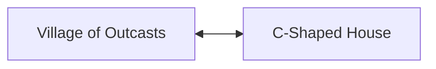
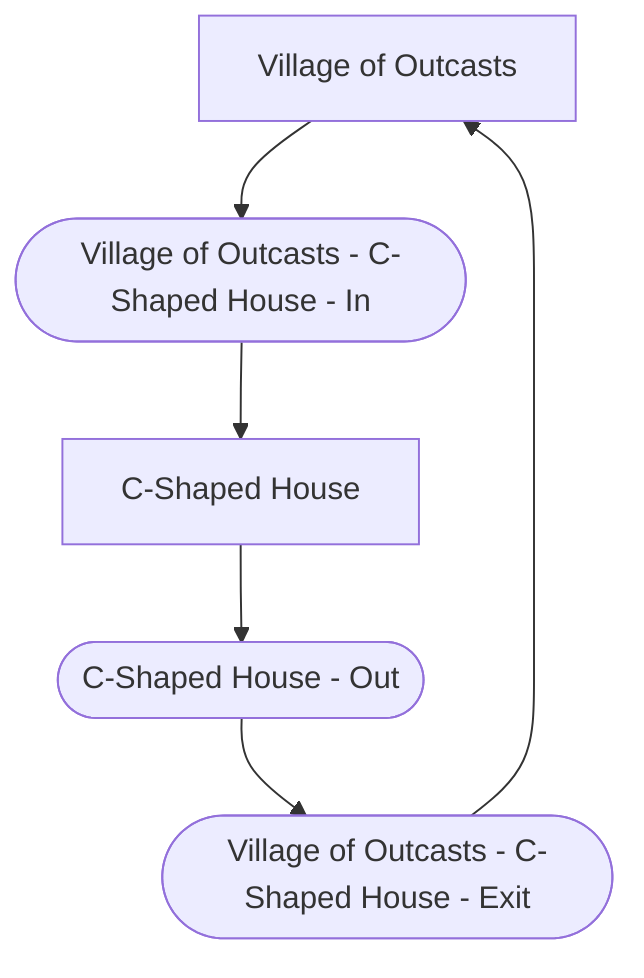

# Entrance Shuffle

crossworld: put underworld cave locations in an array and they will assure that they connections all have the same moonpearliness

## Generated Nodes
Data nodes that have either `inletid`, `outletid` or `entranceid` turn into multiple nodes in the graph.

This data representation for C-Shaped House in Village of Outcasts:


Turns into the following logical graph structure (which ignores edge passage conditions for simplicity):


In practise, there's often additional nodes in-between (for example `Village of Outcasts - C-Shaped House` and `Village of Outcasts - Chest Game`)
which represents the entrance, door or hole.

Entrance definitions always come in pairs:
```yml
fixed:
  # Connect "Village of Outcasts" (the C-Shaped House doorstep) to "C-Shaped House" (inside)
  - ["Village of Outcasts - C-Shaped House - In", "C-Shaped House"]
  - ["C-Shaped House - Out", "Village of Outcasts - C-Shaped House - Exit"]
```

The first connection goes from the overworld region containing the `entranceid` value (which is generated with the suffix `" - In"`)
to the underworld region containing the `inletid` (directly, there is no prefix or suffix for this one).

The second connection goes from the underworld region containing the `inletid` (which is generated with the suffix `" - Exit"`)
to the overworld region containing the `outletid` value (which is generated with the suffix `" - Out"`).

This design is chosen for two reasons:
1. Going inside and going back outside support decoupling (for more chaotic entrance shuffle modes)
1. The transition can support conditions to prevent passage.
   (Caves that require Lamp or cross a Moon Pearl boundary may use these and potentially insert additional edges in between.)

### Holes
Holes work the same way, with minor differences:
1. They use `entranceids` (array instead of just a single one).
1. They normally don't connect the generated `" - Exit"` node to anything (since you can't go back up the hole).
